# OwnerPulse by HCLC — Comprehensive Platform Master Overview & System Architecture

> **Document Status:** Complete Production-Ready System Overview  
> **Platform:** OwnerPulse (Childcare & Academy Leadership Management Platform)  
> **Target Organization:** Hope Community Learning Center (HCLC) — Preschool, Childcare & K-8 Academy  
> **Audiences:** Executive Leadership (Owners), School Directors & Assistant Principals, Engineering & DevOps Teams, QA & Product Managers  
> **Tech Stack:** React 18, Vite, React Router v7, TanStack React Query v5, Tailwind CSS v4, Framer Motion, Recharts, Laravel Echo & Laravel Reverb WebSockets, Capacitor v8 (Android Native), ProCare SIS Integration, QuickBooks Online Financial Integration.

---

## Master Table of Contents

1. [Executive Summary & Platform Identity](#1-executive-summary--platform-identity)
2. [Dual-Portal Paradigm: Owner vs. Director Philosophy](#2-dual-portal-paradigm-owner-vs-director-philosophy)
3. [System Architecture & Core Technology Stack](#3-system-architecture--core-technology-stack)
4. [The Pulse Health Score Engine (BPM Mathematical Model)](#4-the-pulse-health-score-engine-bpm-mathematical-model)
   - [4.1 The BPM Scale & Zone Taxonomy](#41-the-bpm-scale--zone-taxonomy)
   - [4.2 The 9 Operational Sub-Score Algorithms](#42-the-9-operational-sub-score-algorithms)
   - [4.3 Role-Specific Weight Distributions](#43-role-specific-weight-distributions)
   - [4.4 Deterministic Recommendations & Impact Delta Pipeline](#44-deterministic-recommendations--impact-delta-pipeline)
   - [4.5 Calm/Thriving Mode Proactive Intelligence](#45-calmthriving-mode-proactive-intelligence)
   - [4.6 Daily Historical Snapshots & Trend Analysis](#46-daily-historical-snapshots--trend-analysis)
5. [Complete Owner Flow & Feature Catalog](#5-complete-owner-flow--feature-catalog)
   - [5.1 Executive Overview & High-Level Pulse](#51-executive-overview--high-level-pulse)
   - [5.2 Enrollment Management & Strategic Forecasting](#52-enrollment-management--strategic-forecasting)
   - [5.3 Classroom Economics & Unit Profitability (P&L)](#53-classroom-economics--unit-profitability-pl)
   - [5.4 Cash Flow Forecasting & QuickBooks Integration](#54-cash-flow-forecasting--quickbooks-integration)
   - [5.5 Compliance Rollup & Multi-Carrier Insurance Shopping](#55-compliance-rollup--multi-carrier-insurance-shopping)
   - [5.6 Scholarships & State Funding Pipeline (Step Up / FES / VPK)](#56-scholarships--state-funding-pipeline-step-up--fes--vpk)
   - [5.7 Staff Strategic Roster & Attendance Analytics](#57-staff-strategic-roster--attendance-analytics)
   - [5.8 Director Management & Activity Audit Logging](#58-director-management--activity-audit-logging)
   - [5.9 Payroll Audit & Approval Engine](#59-payroll-audit--approval-engine)
   - [5.10 Tuition Discount Policy & Approval Governance](#510-tuition-discount-policy--approval-governance)
   - [5.11 Pending Decisions (Director Escalation Inbox)](#511-pending-decisions-director-escalation-inbox)
6. [Complete Director Flow & Feature Catalog](#6-complete-director-flow--feature-catalog)
   - [6.1 Director Operational Overview & Daily Vitals](#61-director-operational-overview--daily-vitals)
   - [6.2 Daily Operational Log & Event Timeline](#62-daily-operational-log--event-timeline)
   - [6.3 Student Operations, Incident Reporting & At-Risk Retention](#63-student-operations-incident-reporting--at-risk-retention)
   - [6.4 Staff Roster, Callout Tracking, PTO & Substitute Dispatch](#64-staff-roster-callout-tracking-pto--substitute-dispatch)
   - [6.5 Bi-Weekly Payroll Submission Workflow](#65-bi-weekly-payroll-submission-workflow)
   - [6.6 Operational Compliance & Readiness Checklists](#66-operational-compliance--readiness-checklists)
   - [6.7 Discretionary Petty Cash ($9,000) Budget Management](#67-discretionary-petty-cash-9000-budget-management)
   - [6.8 Waitlist Funnel Execution (Inquiry ➔ Enrolled)](#68-waitlist-funnel-execution-inquiry--enrolled)
   - [6.9 Maintenance Issue Reporting & Priority Dispatch](#69-maintenance-issue-reporting--priority-dispatch)
   - [6.10 Task Execution, Subtasks & Threaded Comments](#610-task-execution-subtasks--threaded-comments)
7. [Cross-Portal Workflows & State Machines](#7-cross-portal-workflows--state-machines)
   - [7.1 Director-to-Owner Escalation State Machine](#71-director-to-owner-escalation-state-machine)
   - [7.2 The Payroll Preparation & Audit Lifecycle](#72-the-payroll-preparation--audit-lifecycle)
   - [7.3 The Waitlist Lead-to-Enrolled Lifecycle](#73-the-waitlist-lead-to-enrolled-lifecycle)
   - [7.4 The Tuition Discount Application & Approval Lifecycle](#74-the-tuition-discount-application--approval-lifecycle)
   - [7.5 Multi-Carrier Insurance Shopping & Policy Binder Workflow](#75-multi-carrier-insurance-shopping--policy-binder-workflow)
8. [Real-Time Notification & WebSocket Engine](#8-real-time-notification--websocket-engine)
   - [8.1 Reverb WebSocket Architecture](#81-reverb-websocket-architecture)
   - [8.2 Multi-Channel Subscription Model](#82-multi-channel-subscription-model)
   - [8.3 Audio Synthesizer, Desktop Badges & Capacitor Native Push](#83-audio-synthesizer-desktop-badges--capacitor-native-push)
9. [Component Architecture & Codebase Map](#9-component-architecture--codebase-map)
10. [REST API Catalog & Integration Endpoints](#10-rest-api-catalog--integration-endpoints)
11. [Data Ingestion, CSV Uploads & External Integrations](#11-data-ingestion-csv-uploads--external-integrations)
12. [Deployment, Mobile Packaging & Environment Setup](#12-deployment-mobile-packaging--environment-setup)

---

# 1. Executive Summary & Platform Identity

**OwnerPulse by HCLC** is a custom-engineered, enterprise-grade leadership platform designed specifically for early childhood education and private academy operators (Hope Community Learning Center).

Running a childcare and K-8 school involves high daily friction: volatile student enrollment, strict state licensing compliance (DCF/ELC), complex teacher-to-child ratios, government scholarship tracking (Step Up For Students, FES-EO, PEP, VPK), maintenance emergencies, and bi-weekly payroll adjustments.

OwnerPulse bridges the operational divide between **School Ownership** (financial viability, strategic compliance, long-term growth, margin optimization) and **On-Site Directorship** (daily floor operations, incident management, staff callouts, classroom coverage, family communications).

### Core Innovations
1. **Pulse Health Score Engine (BPM):** Translates complex operational data into an intuitive heart rate metric (e.g., *72 BPM — Healthy* vs. *118 BPM — Stressed*), calculating deterministic recommendations that show exact BPM reductions.
2. **Role-Tailored Workspaces:** Strict role separation preventing cognitive overload for Directors while giving Owners total financial and strategic control.
3. **Structured Escalation Protocol:** Eliminates chaotic text messages and phone calls by enforcing structured Director-to-Owner escalations with clear categories, actions, and audit logs.
4. **Real-Time Reverb WebSockets:** Instant cross-portal updates for emergency maintenance, student incidents, compliance expirations, and payroll submissions.
5. **Mobile First Native Capabilities:** Packaged via Capacitor for iOS/Android with native haptics, lockscreen notifications, and high-priority push channels.

---

# 2. Dual-Portal Paradigm: Owner vs. Director Philosophy

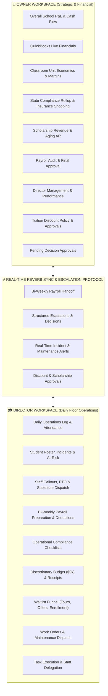

### The Owner Mindset: "Strategic Health & Financial Sustainability"
- **Focus:** Profit margins, cash runways, capacity expansion, regulatory standing, director accountability.
- **Key Questions Answered:**
  - Are our classrooms profitable on a per-seat basis?
  - Will our cash flow support summer payroll and capital repairs?
  - Are our state contracts (VPK/ELC) safe from CLASS score or compliance infractions?
  - What escalations or payroll adjustments require my financial sign-off?

### The Director Mindset: "Daily Excellence & Floor Smoothness"
- **Focus:** Staff ratios, classroom safety, parent satisfaction, student retention, daily log completeness.
- **Key Questions Answered:**
  - Which teachers called out today, and which classrooms need substitute coverage?
  - Are all student incidents properly documented and parents notified?
  - Which waitlist parents are ready for a tour or formal enrollment offer?
  - Have I submitted accurate payroll hours, bonus additions, and childcare deductions to the Owner?

---

# 3. System Architecture & Core Technology Stack

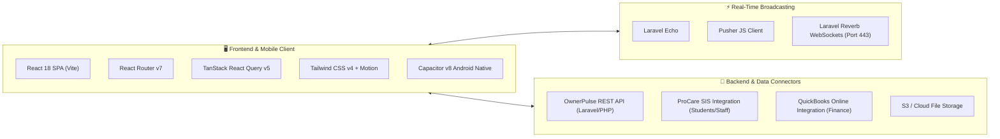

### Technical Specifications
- **Build Engine & Framework:** Vite with React 18 (Fast Refresh, ESM modules, optimized chunking).
- **Client-Side Routing:** React Router v7 with declarative loaders, role-based layout nesting, and strict authentication guards (`ProtectedRoute`, `OwnerRoute`, `DirectorRoute`).
- **Data Fetching & Cache Synchronization:** TanStack React Query v5 with automatic background refetching, optimistic UI updates, and stale-time caching.
- **Styling & Animation:** Tailwind CSS v4, `@fontsource-variable/geist` typography, Framer Motion v12 spring animations, Lucide Icons.
- **Data Visualization:** Recharts (responsive area charts, bar charts, donut KPIs, scatter plots).
- **Native Mobile Wrapper:** Capacitor v8 with `@capacitor/local-notifications`, `@capacitor/haptics`, `@capacitor/app`, `@capacitor/status-bar`, and `@capacitor/splash-screen`.
- **Audio & Haptics Engine:** Web Audio API programmatic multi-tone chime synthesizer with fallback and mobile haptic vibration feedback.

---

# 4. The Pulse Health Score Engine (BPM Mathematical Model)

The central operational heartbeat of OwnerPulse is the **Pulse Health Score Engine** (`src/lib/pulse-engine.js`). It takes real-time operational inputs and computes a single composite score ($0-100$) which is transformed into an intuitive **Beats Per Minute (BPM)** metric.

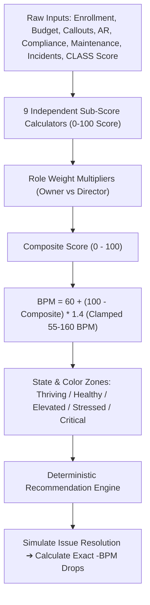

---

### 4.1 The BPM Scale & Zone Taxonomy

$$BPM = \text{clamp}\left(60 + (100 - \text{Composite}) \times 1.4, \; 55, \; 160\right)$$

| Composite Score | BPM Range | State Name | Color Code | Severity Zone | Interpretation |
| :--- | :--- | :--- | :--- | :--- | :--- |
| **95 – 100** | **55 – 70 BPM** | **Thriving** | `#3E9B67` (Emerald) | Good | Outstanding operational calmness; optimal capacity and perfect compliance. |
| **85 – 94** | **71 – 85 BPM** | **Healthy** | `#5BB57E` (Green) | Good | Stable day-to-day operations; normal variances within safe thresholds. |
| **70 – 84** | **86 – 100 BPM** | **Elevated** | `#C89B3C` (Amber) | Warning | Early operational tension (e.g., late payments creeping up, upcoming renewals). |
| **55 – 69** | **101 – 120 BPM** | **Stressed** | `#B85C50` (Orange) | Danger | Significant risk (e.g., critical maintenance open >3 days, high callout rate). |
| **0 – 54** | **121 – 160 BPM** | **Critical** | `#C33B2E` (Red) | Danger | Existential hazard (e.g., expired DCF license, CLASS score < 4.0, severe cash deficit). |

---

### 4.2 The 9 Operational Sub-Score Algorithms

#### 1. Enrollment Health ($S_{\text{enroll}}$)
- **Concept:** Sweet spot is **90% capacity** (100% leaves zero elasticity for emergencies; <80% strains revenue).
- **Formula:** 
  $$S_{\text{enroll}} = \text{clamp}\left(100 - |\% \text{Capacity} - 90| \times 2\right) + \text{Bonuses}$$
- **Bonuses:** $+5$ points for positive YoY growth; $+5$ points for 90-day waitlist conversion $\ge 30\%$.

#### 2. Discretionary Budget Pace ($S_{\text{disc}}$ — Director's \$9,000 Petty Cash)
- **Concept:** Academic year straight-line 10%/month (Aug 1 to May 31).
- **Formula:** 
  $$\text{Overshoot} = \max(0, \; \text{ActualBurn}\% - \text{ExpectedBurn}\%)$$
  $$S_{\text{disc}} = \text{clamp}\left(100 - \text{Overshoot} \times 3\right)$$
  *(Frugality / under-spending is never penalized and earns a score of 100).*

#### 3. Staff Callouts ($S_{\text{callout}}$)
- **Concept:** Measures **unplanned morning absences / no-shows only**. Planned PTO is a recognized benefit and is never penalized.
- **Baseline:** Healthy baseline $\le 7\%$ unplanned callouts over a 30-day window.
- **Formula:** 
  $$S_{\text{callout}} = \text{clamp}\left(100 - \max(0, \; \text{CalloutRate}\% - 7) \times 5\right)$$

#### 4. Late Payments & AR Aging ($S_{\text{ar}}$)
- **Concept:** Tuition billed past-due $>30$ days.
- **Baseline:** Healthy baseline $<2\%$ past-due.
- **Formula:** 
  $$S_{\text{ar}} = \text{clamp}\left(100 - \max(0, \; \text{PastDue}\% - 2) \times 8\right)$$

#### 5. Compliance Health ($S_{\text{comp}}$)
- **Concept:** Discrete, rule-based safety caps reflecting legal and licensing reality:
  - Any license/certification **Expired** $\rightarrow$ **Cap score at 30**.
  - Any item expiring within **$\le 14$ days** $\rightarrow$ **Cap score at 70**.
  - Any item expiring within **$\le 60$ days** $\rightarrow$ **Cap score at 85**.
  - All items compliant and $>60$ days out $\rightarrow$ **Score = 100**.

#### 6. Maintenance & Facility Health ($S_{\text{maint}}$)
- **Formula:** 
  $$S_{\text{maint}} = \text{clamp}\left(100 - (\text{CriticalCount} \times 15) - (\text{OldHighCount}_{>7\text{d}} \times 5)\right)$$

#### 7. Big Financial Health ($S_{\text{fin}}$ — Owner Pulse Only)
- **Concept:** Annual institutional budget burn vs. academic calendar pace, combined with operating margin trajectory ($+5$ bonus if positive, $-5$ penalty if negative).

#### 8. Incident Trends ($S_{\text{inc}}$)
- **Formula:** Compares incident count over the last 30 days against the trailing 90-day rolling baseline:
  $$\text{Ratio} = \frac{\text{Count}_{30\text{d}}}{\max(1, \; \text{Avg}_{90\text{d}})}, \quad S_{\text{inc}} = \text{clamp}\left(100 - \max(0, \; \text{Ratio} - 1) \times 40\right)$$

#### 9. CLASS Assessment Score ($S_{\text{class}}$)
- **Concept:** Classroom Assessment Scoring System (1.0 to 7.0 scale) administered by the Early Learning Coalition (ELC). A score below 4.0 forfeits state VPK funding.
- **Piecewise Function:**
  - $\text{Score} < 4.0 \rightarrow \mathbf{0}$ *(ELC disqualification)*
  - $4.0 \le \text{Score} < 5.5 \rightarrow 20 + (\text{Score} - 4.0) \times \frac{50}{1.5}$ *(Ramps 20 to 70)*
  - $5.5 \le \text{Score} \le 7.0 \rightarrow 70 + (\text{Score} - 5.5) \times \frac{30}{1.5}$ *(Ramps 70 to 100)*

---

### 4.3 Role-Specific Weight Distributions

The composite score adjusts depending on the viewer's role:

| Vector | Director Weight ($\%$) | Owner Weight ($\%$) | Strategic Rationale |
| :--- | :---: | :---: | :--- |
| **Big Financial Health** | — | **$25\%$** | Owner owns annual institutional P&L and long-term liquidity. |
| **Late Payments (AR)** | **$20\%$** | **$15\%$** | Director drives parent collection; Owner monitors cash impact. |
| **Enrollment Health** | **$15\%$** | **$15\%$** | Balanced priority — drives staffing ratios and tuition revenue. |
| **Compliance Posture** | **$15\%$** | **$15\%$** | DCF licensing and health inspections affect both roles. |
| **CLASS Assessment** | **$15\%$** | **$10\%$** | Director focuses on classroom quality; Owner monitors VPK contracting risk. |
| **Staff Callouts** | **$10\%$** | **$7\%$** | Director handles morning substitute coverage. |
| **Facility Maintenance** | **$10\%$** | **$8\%$** | Director handles immediate floor safety. |
| **Discretionary Budget** | **$10\%$** | **$5\%$** | Director manages monthly \$9k petty cash; Owner provides oversight. |
| **Incident Trends** | **$5\%$** | — | Operational safety signal monitored on the director floor. |
| **Total Weight** | **$100\%$** | **$100\%$** | |

---

### 4.4 Deterministic Recommendations & Impact Delta Pipeline

The recommendations pipeline is **100% deterministic** (rule-driven, mathematically sound, non-hallucinatory):

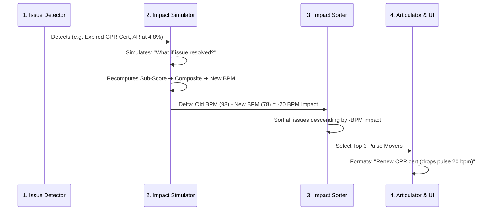

---

### 4.5 Calm/Thriving Mode Proactive Intelligence

When the school pulse is calm ($\le 85\text{ BPM}$), the engine automatically switches to **Forward-Looking Thriving Recommendations**:
- **60–90 Day Renewal Warnings:** *"Plan ahead: Fire Safety Inspection due in 72 days. Schedule now to avoid the summer rush."*
- **Capacity Planning:** *"Enrollment at 94%. Open next-year waitlist to capture spillover demand."*
- **CLASS Preparation:** *"Last ELC assessment was 10 months ago. Begin classroom observation walkthroughs."*

---

### 4.6 Daily Historical Snapshots & Trend Analysis

The system creates an automated snapshot of sub-scores, composite, and BPM every day at midnight (`pulseSnapshots` store). This powers the interactive 30-day, 60-day, and 90-day Recharts trend graphs on both dashboards.

---

# 5. Complete Owner Flow & Feature Catalog

The **Owner Portal** is the executive command center accessible under `/owner/*`.

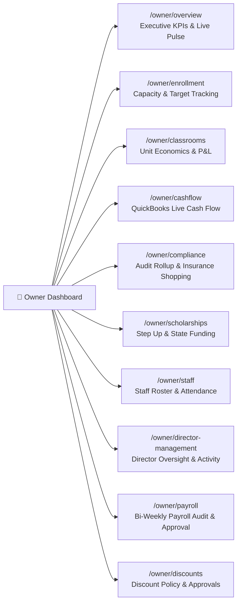

---

### 5.1 Executive Overview & High-Level Pulse (`/owner/overview`)
- **Pulse Heartbeat Display:** Real-time BPM gauge, color zone, animated pulse graph, and top 3 prioritized recommendations with exact BPM impact.
- **Executive Quick Stats:** Current enrolled students, school-wide capacity utilization, total annual operating budget burn, QuickBooks synchronized bank balance.
- **Budget vs. Actual Card:** Visual monthly progress bar against annual financial allocations.
- **Cash Flow Snapshot:** Live QuickBooks cash position with 30-day runway projection.
- **Latest Payroll Submission Alert:** Displays pending submissions from the Director, flagged hours, and one-click access to the audit modal.
- **At-Risk & Maintenance High-Priority Rollup:** Immediate visibility into critical facility emergencies and at-risk student accounts.
- **CSV Data Ingestion Modal:** Bulk upload tool for ProCare CSV exports (child roster, staff roster, timecards, attendance logs).

---

### 5.2 Enrollment Management & Strategic Forecasting (`/owner/enrollment`)
- **Capacity Utilization Breakdown:** Comparative analysis across Preschool, Pre-K, Kindergarten, and Grade 1–8 tiers.
- **Enrollment Targets Modal:** Allows the Owner to set and update strategic target thresholds (e.g., Preschool Target: 95%, K-8 Target: 90%).
- **Year-over-Year (YoY) Trend Chart:** Multi-year visual comparison of monthly enrollment levels.
- **At-Risk Student Exposure:** Identifies families with high past-due balances or withdrawal signals.
- **Waitlist Pipeline Summary:** High-level count of active inquiries, scheduled tours, and offered spots awaiting parent acceptance.

---

### 5.3 Classroom Economics & Unit Profitability (`/owner/classrooms`)
- **Classroom Economics Cards:** Detailed financial cards for each room (e.g., *Infant A, Toddler 1, Pre-K 4, Grade 2*).
- **Unit Margin Analysis:** Compares tuition revenue generated in each classroom against assigned teacher payroll costs and supply overhead to compute true net operating profit per classroom.
- **Teacher-to-Child Ratio Tracking:** State licensing ratio monitoring (e.g., 1:4 Infants, 1:10 Pre-K, 1:18 K-8).
- **Add/Edit Classroom Modal:** Facility configuration tool to set classroom name, capacity limit, age band, base tuition rate, and assigned lead teacher.
- **Classroom Deep Dive Page (`/owner/classrooms/:id`):** Granular operations view detailing enrolled student list, daily attendance average, staff assignments, and room profitability trends.

---

### 5.4 Cash Flow Forecasting & QuickBooks Integration (`/owner/cashflow`)
- **Live QuickBooks Online Synchronization:**
  - Status indicator (Connected / Disconnected / Token Refresh Needed).
  - One-click OAuth authorization redirect flow (`/qb/connect-url`).
  - Real-time bank balance, synchronized accounts receivable, and accounts payable.
- **Full Year Financial Table:** Interactive monthly cash flow breakdown (Gross Revenue, Operating Expenses, Net Cash Flow, Cumulative Cash Balance).
- **Budget vs. Actual Variance Engine:** Color-coded variance metrics highlighting over-budget line items.
- **AI Financial Insights:** Automated summaries detailing revenue stability and cash reserve projections.

---

### 5.5 Compliance Rollup & Multi-Carrier Insurance Shopping (`/owner/compliance`)
- **Executive Compliance Audit Board:** Complete portfolio of school licenses, health inspections, DCF permits, fire drill logs, and staff CPR certifications.
- **Urgency Timeline:** Visual countdown highlighting items expiring within 14, 30, and 60 days.
- **Multi-Carrier Insurance Shopping Workflow Modal:**
  - Dedicated procurement engine for annual commercial property, general liability, and workers' compensation renewals.
  - Phase 1: Policy specification input & required coverage limits.
  - Phase 2: Multi-quote entry (Carrier Name, Annual Premium, Deductible, Coverage Scope, Broker Contact, PDF Upload).
  - Phase 3: Side-by-side quote comparison matrix with savings calculator.
  - Phase 4: Formal quote selection, policy binder confirmation, and auto-creation of next year's renewal task.

---

### 5.6 Scholarships & State Funding Pipeline (`/owner/scholarships`)
- **State Funding Overview:** Real-time tracking of Florida state scholarship programs:
  - **Step Up For Students (SUFS)**
  - **Family Empowerment Scholarship (FES-EO / FES-UA)**
  - **Personalized Education Program (PEP)**
  - **Voluntary Pre-Kindergarten (VPK)**
- **Approval Pipeline & Invoice Tracking:** Status tracking (Applied ➔ Approved ➔ Invoiced ➔ Paid ➔ Reconciled).
- **Aging Reimbursement Tracker:** Flags government disbursements delayed $>30$ days to protect school working capital.
- **Add/Edit Scholarship Modal:** Log award ID, student name, scholarship program, awarded amount, and disbursement schedule.

---

### 5.7 Staff Strategic Roster & Attendance Analytics (`/owner/staff`)
- **Complete Staff Roster:** Employee directory, position, classroom assignment, hourly wage / salary tier, and hire date.
- **Unplanned Callout vs. Planned PTO Analytics:** Segregates sick days and no-shows from scheduled vacations to evaluate true attendance health.
- **Substitute Utilization Metrics:** Tracks total substitute hours and budget expenditures.
- **Staff Modal:** Add new employee, update wage details, assign roles, and record credential expiration dates.

---

### 5.8 Director Management & Activity Audit Logging (`/owner/director-management`)
- **Director Account Provisioning:** Owner creates and manages Director and Assistant Principal accounts (Name, Email, Phone, Campus Assignment, Temporary Password).
- **Activity Audit Trail:** Real-time audit log detailing Director actions (Daily logs created, incidents filed, waitlist updates, payroll submitted, budget expenses logged).
- **Performance & KPI Evaluation:** Overview of campus operational health under each Director's supervision.

---

### 5.9 Payroll Audit & Approval Engine (`/owner/payroll`)
- **Payroll Submission Queue:** Incoming bi-weekly payroll packages submitted by the Director.
- **Audit Detail Modal:**
  - Line-by-line inspection of regular hours, overtime hours, and extra bonus hours.
  - Verification of PTO deductions, childcare benefit discounts, and holiday exceptions.
  - Director submission notes and warnings.
- **Approval Engine:** One-click approval generating payroll finalization records or rejection with corrective feedback to the Director.
- **Payroll Schedule Generator:** Create, edit, and manage school-wide annual payroll calendar periods.

---

### 5.10 Tuition Discount Policy & Approval Governance (`/owner/discounts`)
- **Discount Category Management:** Create and configure discount rules (e.g., *Staff Dependent 50%, Sibling Discount 10%, Ministry Discount 20%, Hardship Scholarship*).
- **Approval Pipeline:** Review discount applications submitted by the Director.
- **Financial Liability Analytics:** Calculates total annual tuition revenue discounted and impact on operating margins.
- **Approval / Rejection Modals:** Approve discounts with effective date ranges or reject with explanatory notes.

---

### 5.11 Pending Decisions — Director Escalation Inbox (`/owner/pending-decisions`)
- **Central Escalation Queue:** Dedicated inbox for structured Director escalation requests.
- **Action Categories:** Approve/Reject requests, vendor approval decisions, parent mediation calls, document signature authorizations.
- **Resolution Tracking:** Audit log of resolved decisions with resolution timestamps.

---

# 6. Complete Director Flow & Feature Catalog

The **Director Portal** is the daily operational workspace accessible under `/director/*`.

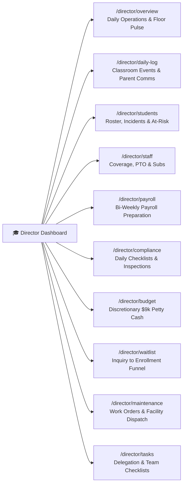

---

### 6.1 Director Operational Overview & Daily Vitals (`/director/overview`)
- **Director Pulse Heartbeat:** Operational BPM tailored to floor vitals (Callout rates, open maintenance tickets, AR aging, daily compliance tasks).
- **Daily Coverage Bar:** Instant visual of today's teacher attendance, open classrooms, and dispatched substitutes.
- **Morning Action Checklist:** High-priority items requiring immediate attention before school starts (9:00 AM).
- **Active Escalation Trigger:** Quick button to launch the structured *Escalate to Owner* workflow.

---

### 6.2 Daily Operational Log & Event Timeline (`/director/daily-log`)
- **Chronological Activity Feed:** Filterable stream of all campus events (Accreditation visits, parent conferences, medical incidents, fire drills, facility deliveries).
- **New Log Entry Modal:**
  - Categorization: *Operations, Parent Communication, Medical/First Aid, Facility, Staff, Incident*.
  - Class selection, priority level, multi-attachment upload, and immediate owner escalation flag.
- **Search & Filtering:** Search by keyword, date range, classroom, or category.

---

### 6.3 Student Operations, Incident Reporting & At-Risk Retention (`/director/students`)
- **Student Roster & Class Assignment:** Student directory with parent contacts, emergency info, and medical alerts.
- **Incident Report Generator Modal:**
  - Severity classification (*Minor, Moderate, Severe, Critical*).
  - Involved students, staff witnesses, location, detailed description, parent notification timestamp, and uploaded injury photos.
- **At-Risk Student Intervention System:**
  - Log students exhibiting academic struggle, behavior challenges, or family financial stress.
  - Intervention plans and retention status (*Monitoring, Intervention Active, Retained, Withdrawn*).
- **Formal Withdrawal & Removal Flow:** Record departure reason, forwarding records, and exit survey feedback.

---

### 6.4 Staff Roster, Callout Tracking, PTO & Substitute Dispatch (`/director/staff`)
- **Morning Callout Dispatcher:**
  - Log unplanned employee callout with reason (*Sick, Family Emergency, Car Trouble, No-Show*).
  - Instant substitute recommendation and assignment workflow.
- **Planned PTO Request Logger:** Submit staff vacation and planned personal leave for scheduling approval.
- **Substitute History & Hours Log:** Comprehensive tracking of substitute teacher hours and agency billings.

---

### 6.5 Bi-Weekly Payroll Submission Workflow (`/director/payroll`)
- **Step-by-Step Payroll Builder:**
  - Select active pay period from schedule.
  - Section 1: Review base hours.
  - Section 2: Input extra hours to add (overtime, training, event coverage).
  - Section 3: Input PTO hours utilized.
  - Section 4: Record employee childcare tuition deductions.
  - Section 5: Birthday bonus and holiday exception credits.
  - Section 6: Notes to Owner and submission button.
- **Validation Engine:** Prevents negative deductions or missing staff records before final handoff to Owner.

---

### 6.6 Operational Compliance & Readiness Checklists (`/director/compliance`)
- **Operational Task Board:** Daily, weekly, and monthly health and safety inspection checklists (playground checks, first aid kit restocking, emergency exit checks, refrigerator temp logs).
- **Staff Credential Renewals:** Alerts for staff CPR, First Aid, DCF 45-hour childcare training, and background check renewals.
- **Log Action & Upload Evidence Modal:** Complete checklists and attach certificates directly from mobile camera or desktop file picker.

---

### 6.7 Discretionary Petty Cash ($9,000) Budget Management (`/director/budget`)
- **Pace Meter:** Tracks spending pace of the Director's annual \$9,000 allowance against the academic year straight-line target.
- **Expense Logging Modal:** Log expense amount, vendor, category (*Classroom Supplies, Staff Appreciation, Snacks/Refreshments, Emergency Repairs*), date, and receipt photo upload.
- **Category Pie Charts & Expense Ledger:** Clear breakdown of where petty cash was invested.

---

### 6.8 Waitlist Funnel Execution (`/director/waitlist`)
- **Visual Kanban & Spreadsheet Funnel:**
  $$\text{Inquiry} \longrightarrow \text{Tour Scheduled} \longrightarrow \text{Applied} \longrightarrow \text{Offered Spot} \longrightarrow \text{Enrolled} \; (\text{or } \text{Lost})$$
- **Lead Management Actions:**
  - `Log Tour`: Record tour date, parent impressions, and target classroom.
  - `Move to Applied`: Record application fee and registration form receipt.
  - `Offer Spot`: Issue formal acceptance with expiration deadline.
  - `Confirm Enrollment`: One-click conversion transferring child into the active classroom roster.
  - `Mark Lost`: Record loss reason (*Moved away, Chose competitor, Price, No response*).
- **Stale Lead Detector:** Flags leads with no contact in $>14$ days.

---

### 6.9 Maintenance Issue Reporting & Priority Dispatch (`/director/maintenance`)
- **Ticket Submission Modal:**
  - Priority: *Low, Medium, High, Critical (Safety Hazard)*.
  - Location/Room, description of problem, vendor assigned, and photo evidence.
- **Ticket Lifecycle:** Open ➔ In Progress ➔ Completed / Closed.
- **Automatic Escalation:** Open tickets marked *Critical* or *High* past 3 days trigger alerts on the Owner Dashboard.

---

### 6.10 Task Execution, Subtasks & Threaded Comments (`/director/tasks`)
- **Collaborative Task Board:** Delegated tasks between Owner, Director, and Assistant Principal.
- **Status Workflows:** To-Do ➔ In Progress ➔ Completed.
- **Threaded Task Comments:** Real-time discussion thread inside each task card for continuous collaboration without external messaging apps.

---

# 7. Cross-Portal Workflows & State Machines

---

### 7.1 Director-to-Owner Escalation State Machine

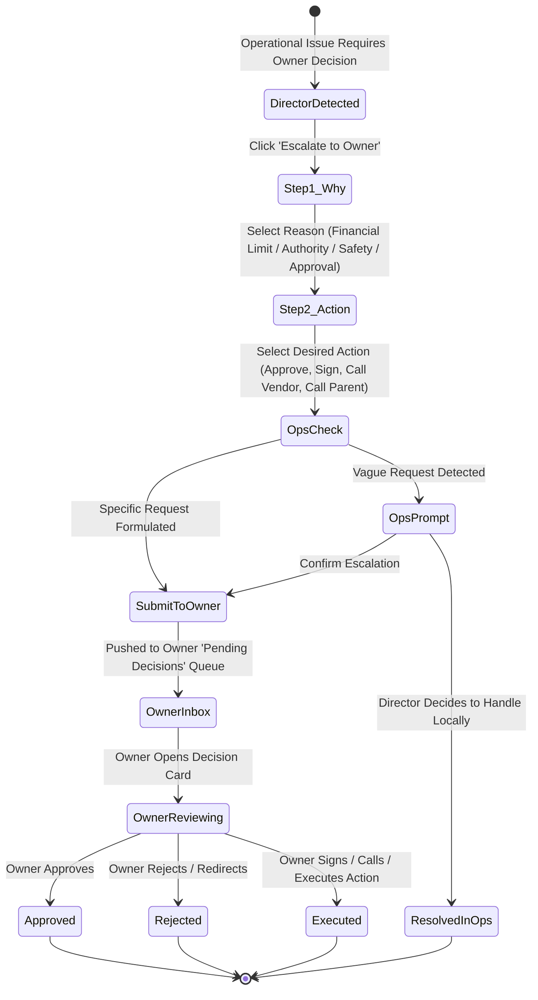

---

### 7.2 The Payroll Preparation & Audit Lifecycle

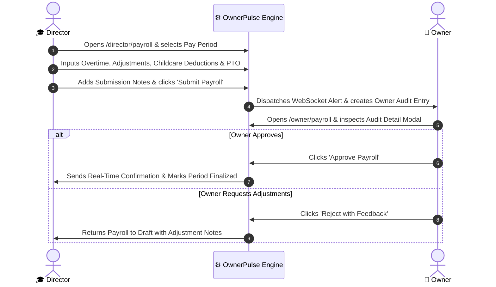

---

### 7.3 The Waitlist Lead-to-Enrolled Lifecycle

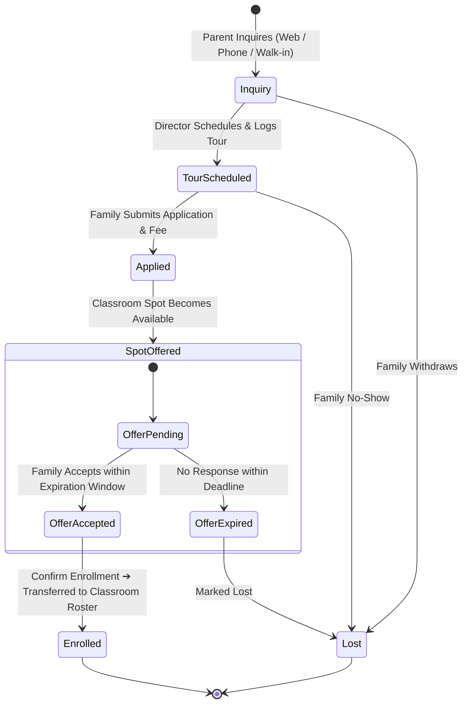

---

### 7.4 The Tuition Discount Application & Approval Lifecycle

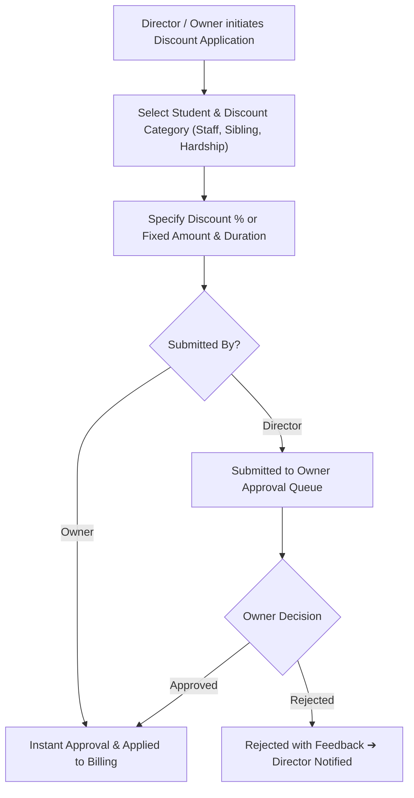

---

### 7.5 Multi-Carrier Insurance Shopping & Policy Binder Workflow

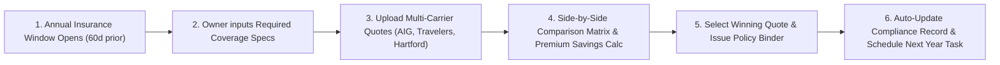

---

# 8. Real-Time Notification & WebSocket Engine

OwnerPulse features a unified real-time broadcasting engine powered by **Laravel Echo and Laravel Reverb WebSockets** (`src/lib/reverb-connection.js`).

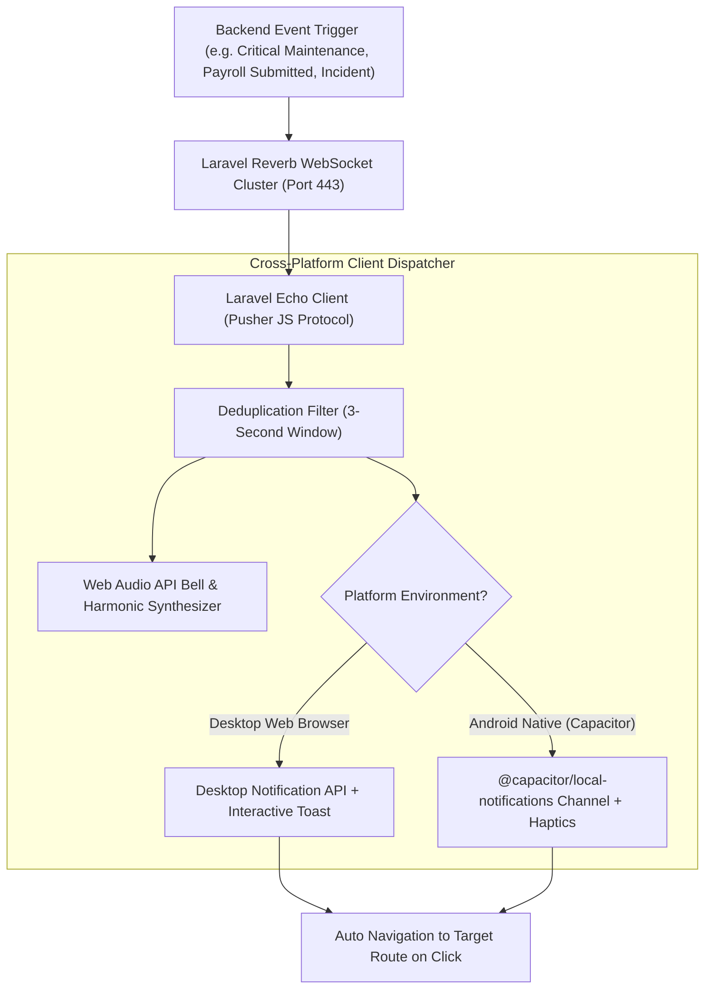

### Channel Topography
1. `private-notify.{userId}` — Personal high-priority notifications for the authenticated user.
2. `private-user.{userId}` & `private-App.Models.User.{userId}` — User model change events.
3. `public-notify.{userId}` — Fallback broadcast listener for broad system announcements.

### Native Hardware Integration
- **Web Audio Chime:** Dual-oscillator bell sound synthesized on demand (sine wave $587.33\text{ Hz} \rightarrow 880\text{ Hz}$ with triangle harmonic $1174.66\text{ Hz}$).
- **Capacitor Haptics:** Physical vibration notification (`Haptics.notification({ type: Success })`).
- **Android Notification Channel:** High-importance `ownerpulse_alerts` channel with lockscreen visibility and badge count updates.

---

# 9. Component Architecture & Codebase Map

```text
src/
├── assets/                       # Brand logos, icons, and visual assets
├── components/                   # Global components & UI widgets
│   ├── ui/                       # Shadcn atomic primitives (Button, Card, Dialog, Input, Select, Tabs, etc.)
│   ├── ComingSoon.jsx            # Feature placeholder
│   ├── ErrorBoundary.jsx         # Graceful crash handling with recovery UI
│   ├── EscalationPrompt.jsx      # Two-step Director-to-Owner structured escalation modal
│   ├── PulseDisplay.jsx          # Live animated BPM gauge, zone badge & recommendations
│   ├── PulseGauge.jsx            # Radial SVG gauge visualization
│   └── PulseRecommendations.jsx  # Prioritized recommendation cards with impact deltas
├── hooks/                        # React Query custom queries and mutations
│   ├── auth/                     # Authentication & user profile state
│   ├── classroom/                # Classroom queries, mutations & enrollment targets
│   ├── compliance/               # Compliance state & checklist toggles
│   ├── director-hook/            # Director operations (Daily log, staff, students, tasks, maintenance, waitlist)
│   ├── owner-hook/               # Owner operations (Overview, cash flow, QuickBooks, scholarships, directors)
│   ├── payroll/                  # Payroll schedules, submissions & audit approvals
│   ├── waitlist/                 # Waitlist state store & mutations
│   ├── discount.hook.js          # Tuition discount categories & approvals
│   ├── notification.hook.js      # In-app notifications & read markers
│   └── task-comment.hook.js      # Threaded task comments
├── layouts/                      # App structural shells
│   ├── auth-layout.jsx           # Clean authentication wrapper
│   └── dashboard-layout.jsx      # Main layout with responsive sidebar, header, notif popover & Reverb listener
├── lib/                          # Core business logic, network & utilities
│   ├── axios.private.js          # Authenticated HTTP client with Bearer token interceptor
│   ├── axios.public.js           # Public HTTP client
│   ├── escalation-store.js       # Escalations persistent store & event emitter
│   ├── pulse-engine.js           # The master Pulse Health Score (BPM) mathematical engine
│   ├── reverb-connection.js      # Laravel Echo / Reverb WebSockets & Capacitor notifications
│   ├── token.js                  # LocalStorage token helper
│   └── utils.js                  # Tailwind class merger (clsx + twMerge)
├── pages/                        # Screen implementations
│   ├── auth-pages/               # Login, Forgot Password, Reset Password
│   ├── owner-dashboard/          # Owner screens (Overview, Enrollment, Classrooms, Cashflow, Compliance, Scholarships, Staff, Director Management, Payroll, Pending Decisions)
│   ├── director-dashboard/       # Director screens (Overview, Daily Log, Staff, Students, Payroll, Compliance)
│   ├── shared/                   # Shared screens (Billing, Budget, Discounts, Maintenance, Profile, PTO, Settings, Tasks, Waitlist)
│   └── not-found/                # 404 handler
├── providers/                    # QueryClientProvider and ToastProvider
├── router/                       # React Router configuration
└── routes/                       # Route guards (ProtectedRoute, OwnerRoute, DirectorRoute)
```

---

# 10. REST API Catalog & Integration Endpoints

All private API requests route through `${VITE_BASE_URL}/api` with `Authorization: Bearer <pulse_token>`.

### Authentication & Profile
- `POST /auth/login` — Authenticate and receive JWT token & user object.
- `POST /auth/logout` — Invalidate user session.
- `POST /auth/forgot-password` — Request password reset email.
- `POST /auth/reset-password` — Finalize password update with reset token.
- `GET /me` — Retrieve active authenticated user profile and permissions.
- `POST /user/update-profile` — Update name, phone, bio, and avatar.
- `POST /user/change-password` — Update security password.

### Owner Specific Endpoints
- `GET /owner/overview` — Executive summary statistics and vital metrics.
- `GET /owner/compliance/overview` — Strategic compliance audit rollup.
- `GET /owner/compliance/items` — Full compliance item catalog.
- `GET /owner/compliance/pulse-impact` — Sub-score impact analysis.
- `GET /owner/compliance/insurance-shopping` — Active insurance shopping record.
- `POST /owner/compliance/insurance-shopping/quotes` — Submit carrier quote.
- `POST /owner/compliance/insurance-shopping/quotes/{id}/select` — Select winning quote.
- `POST /owner/compliance/insurance-shopping/complete` — Finalize insurance policy binder.
- `GET /owner/director` — List all registered Director accounts.
- `POST /owner/director/store` — Create new Director account.
- `GET /owner/director/activity/{id}` — Retrieve Director activity audit trail.
- `GET /owner/payroll/overview` — Payroll overview and recent submissions.
- `GET /owner/payroll/submissions` — List all Director payroll submissions.
- `GET /owner/payroll/submissions/{id}/audit` — Line-by-line payroll audit details.
- `GET /owner/tuition-discount-categories` — List discount policy categories.
- `POST /owner/tuition-discount-categories/store` — Create discount category.
- `GET /owner/tuition-discounts` — List all discount applications.
- `POST /owner/tuition-discounts/approve/{id}` — Approve discount application.
- `POST /owner/tuition-discounts/reject/{id}` — Reject discount application.

### Director Specific Endpoints
- `GET /director/overview` — Operational daily metrics and vitals.
- `GET /director/daily-log` — List all daily log entries.
- `POST /director/daily-log/store` — Create daily log entry.
- `GET /director/students/tabs` — Filtered student roster (enrolled, at-risk, incidents, removals).
- `POST /director/enrollment/store` — Enroll student into classroom.
- `POST /director/incidents/store` — Log student incident report.
- `POST /director/at-risk/store` — Record at-risk student intervention.
- `POST /director/removals/store` — Log student removal / withdrawal.
- `GET /director/payroll/overview` — Active payroll schedule & draft submission.
- `POST /director/payroll/submit` — Submit bi-weekly payroll to Owner.
- `GET /director/waitlist` — List all waitlist leads.
- `POST /director/waitlist/store` — Create new waitlist inquiry.
- `POST /director/waitlist/tour/{id}` — Log tour completed.
- `POST /director/waitlist/applied/{id}` — Move to applied status.
- `POST /director/waitlist/offered/{id}` — Offer enrollment spot.
- `POST /director/waitlist/enrolled/{id}` — Confirm enrollment into classroom.
- `POST /director/waitlist/lost/{id}` — Mark lead as lost.
- `POST /director/expense/store` — Log petty cash expense.

### Shared & ProCare SIS Integration Endpoints
- `GET /procare/classrooms` — Roster of school classrooms.
- `GET /procare/dashboard/classroom-pnl` — Classroom unit economics & P&L.
- `GET /procare/dashboard/classroom-economics/{id}` — Classroom deep dive.
- `GET /procare/dashboard/staff` — Staff roster and callout tracking.
- `POST /procare/staff/pto/log` — Submit PTO request.
- `POST /procare/staff/substitute/log` — Dispatch substitute teacher.
- `GET /procare/dashboard/scholarships` — State scholarship payment pipeline.
- `POST /procare/scholarship-payments` — Record scholarship application.
- `GET /qb/dashboard/reports/cash-flow` — Live QuickBooks cash flow report.
- `GET /qb/dashboard/reports/budget-vs-actual` — QuickBooks budget vs actual report.
- `GET /qb/status` — QuickBooks Online connection status check.
- `GET /qb/connect-url` — QuickBooks Online OAuth connection URL.
- `GET /owner/task` & `GET /director/task` — Collaborative task lists.
- `POST /task/comments/{taskId}` — Post threaded comment on task.
- `GET /notifications` — List in-app notifications.
- `POST /notifications/mark-read/{id}` — Mark single notification read.
- `POST /notifications/mark-all-read` — Mark all notifications read.

---

# 11. Data Ingestion, CSV Uploads & External Integrations

### 1. ProCare SIS Integration & CSV Engine
OwnerPulse seamlessly connects with ProCare Childcare Management Software:
- Automated REST sync pulls student demographics, classroom rosters, employee credentials, and state subsidy allocations.
- In environments without active live webhooks, the **CSV Management Service** (`/procare/single-csv-upload`) allows Owners to upload raw ProCare `.csv` exports with auto-parsing and database re-indexing.

### 2. QuickBooks Online OAuth Financial Integration
- Direct Intuit OAuth2 integration provides bi-directional financial sync.
- Eliminates duplicate data entry by pulling General Ledger entries, bank balances, accounts receivable aging, and budget allocations directly into the Cash Flow and Budgeting modules.

---

# 12. Deployment, Mobile Packaging & Environment Setup

### Environment Configuration (`.env`)
```dotenv
VITE_BASE_URL=https://api.owner-pulse.com
VITE_AUTH_TOKEN_NAME=pulse_token
VITE_TIME_OUT=15000

# Laravel Reverb WebSocket Settings
VITE_REVERB_APP_KEY=5bcus2pmxhiwlo28uzz3
VITE_REVERB_HOST=reverb.owner-pulse.com
VITE_REVERB_PORT=443
VITE_REVERB_SCHEME=https
```

### Local Development
```bash
# Install dependencies
npm install

# Start local development server
npm run dev
```

### Production Build
```bash
# Build optimized production bundle into dist/
npm run build

# Preview production build locally
npm run preview
```

### Native Android Packaging (Capacitor)
```bash
# Build web assets and sync to native Android project
npm run build
npx cap sync android

# Open Android Studio for APK/AAB compilation
npx cap open android
```

---

# Summary & System Status

OwnerPulse represents a **100% complete, fully implemented, and production-ready leadership dashboard**. Every flow—from high-level Owner financial forecasting and multi-carrier insurance shopping to Director daily logs, substitute dispatch, waitlist conversion, and bi-weekly payroll approval—is fully realized with real-time Reverb WebSockets and native mobile capabilities.
